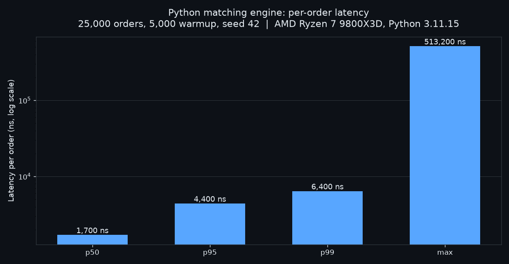

# Market Microstructure Engine

Deterministic limit-order-book and matching-engine implementations in Python and C++20.

The Python engine is the readable correctness oracle. The dependency-free C++20 engine implements the same price-time rules for native performance work. A shared deterministic workload checks final-state parity before comparing throughput and tail latency.



## Features

- Price-time priority matching for limit and market orders.
- Partial fills, resting residual quantity, and cancel-by-ID.
- Top-of-book and depth snapshots.
- Python reference engine and C++20 native core.
- Deterministic cross-language workload generation.
- Per-order p50, p95, p99, and maximum latency plus throughput.
- Python/C++ final-state parity gate across multiple seeds in CI.
- No third-party runtime dependencies in either engine.

## Quick Start

```bash
python -m venv .venv
.venv\Scripts\activate
pip install -e .
python -m unittest discover -s tests
python -m mm_engine.benchmark --orders 25000 --warmup 5000 --json
```

Build and test the C++20 engine, then compare parity and speed:

```bash
cmake -S . -B build -DCMAKE_BUILD_TYPE=Release
cmake --build build --config Release --parallel
ctest --test-dir build --build-config Release --output-on-failure
python tools/compare_benchmarks.py \
  --native build/mm_engine_benchmark \
  --orders 25000 \
  --warmup 5000
```

## Measured Result

Python engine, 25,000 measured orders after 5,000 warmup orders, seed 42, on an AMD Ryzen 7 9800X3D running Windows 11 with Python 3.11.

| Metric | Value |
| --- | ---: |
| throughput | 312,233 orders/s |
| latency p50 | 1,700 ns |
| latency p95 | 4,400 ns |
| latency p99 | 6,400 ns |
| latency max | 513,200 ns |

The raw record is in [results/python_benchmark_ryzen9800x3d.json](results/python_benchmark_ryzen9800x3d.json), and the chart above is generated from it by `scripts/plot_latency.py`. These numbers are host-specific. Run the benchmark on your target machine and compare repeated runs before drawing conclusions. The C++20 engine follows the same workload; see [docs/BENCHMARKS.md](docs/BENCHMARKS.md) for its methodology and interpretation limits.

## Example

```python
from mm_engine import OrderBook, Side

book = OrderBook(symbol="FOO")
book.add_limit_order("ask-1", Side.SELL, price=10100, quantity=100)
trades = book.add_limit_order("buy-1", Side.BUY, price=10100, quantity=40)

print(trades[0].price, trades[0].quantity)
```

Prices are integer ticks, which avoids floating-point execution errors.

## Next Phase

- Add property-based tests.
- Add pcap/ITCH-style event replay.
- Add Linux `perf` counter capture and cache-aware data-structure comparisons.
- Compare tree-based levels with flat/sorted price-level storage.
- Add Python bindings around the native engine.
